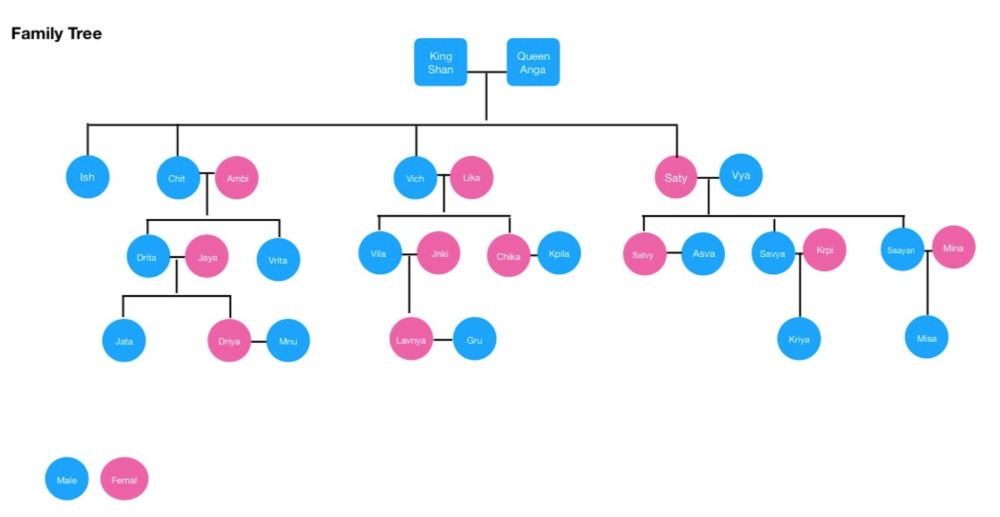

<!--
@Author: Johnny Mao <DIMao>
@Date:   03/06/2018
@Email:  maodi101@gmail.com
-->

# Introduction

This program model out the Shan family tree so that given a "name" and a "relationship" as input, the output are the people that correspond to the relationship.

## Sample Input & output:
Input: Person = Ish; Relation = Brother;
Expected Output: Chit, Vich

# Installation & Usage

1.  Make sure JDK 8 and Maven 3 are installed
2.  `git clone https://github.com/johnny-dash/family-tree`
3.  `cd family-tree`

## Build and run unit test

`mvn clean install`

## Run

`java -jar target/*.jar`

# Assumptions

1.  All the couple are heterosexuality.
2.  Only when a person get marry, he/she could have children.

# Note

In the case that person in the family tree may don't have parent, spouse or the gender is not match with the relationship, the corresponding error will be popped up in the console.

# Relations Reference

## The following words are the relations that supported as input in this program:

* Paternal Uncle
* Maternal Uncle
* Paternal Aunt
* Maternal Aunt
* Sister In Law
* Brother In Law
* Cousin
* Father
* Mother
* Children
* Son
* Daughter
* Brother
* Sister
* Grand Daughter
* Grand Son

## The King Shan's Family Tree Diagram:

